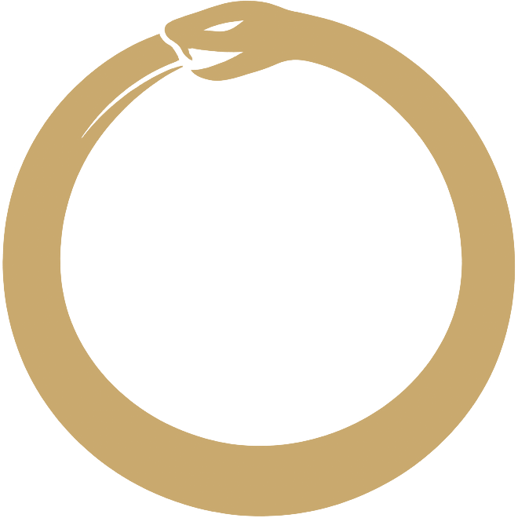

<div align="center">



<!-- omit in toc -->
# Research

**Deep research and technical reference articles from Coroboros**

Curated knowledge that feeds our open skills, tools, and docs.

[](LICENSE.md)
[](LICENSE.md)
[](https://github.com/coroboros/research)
[](https://github.com/coroboros/agent-skills)
[](https://coroboros.com)

</div>

- [Articles](#articles)
- [Notes](#notes)
- [How to cite](#how-to-cite)
- [Contributing](#contributing)
- [License](#license)

---

## Articles

Long-form technical references under [articles/](articles/). See [INDEX.md](INDEX.md) for the full cross-topic index (articles and notes).

| Article | Topics |
|---------|--------|
| [Building award-winning websites: a complete technical reference for 2025–2026](articles/building-award-winning-websites-2025-2026.md) | web-design, awwwards, animation, performance |

---

## Notes

Short-form observations, hypotheses, and synthesis pieces under [notes/](notes/).

*(none yet)*

---

## How to cite

```
Coroboros Research. "Building award-winning websites: a complete technical reference for 2025–2026."
https://github.com/coroboros/research/blob/main/articles/building-award-winning-websites-2025-2026.md
```

See [License](#license) for usage terms.

---

## Contributing

Articles and notes follow [`.claude/rules/doc-authoring.md`](.claude/rules/doc-authoring.md).

---

## License

[CC BY 4.0 — prose](LICENSE.md) · [MIT — code](LICENSE.md)
