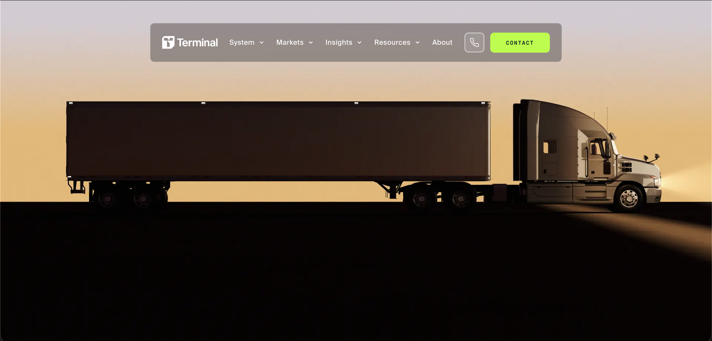
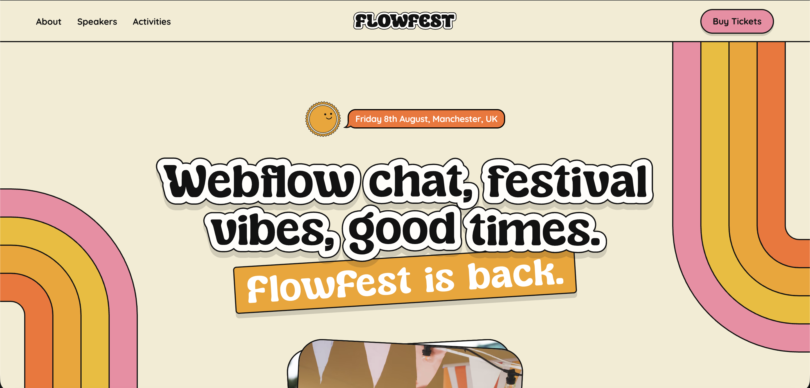
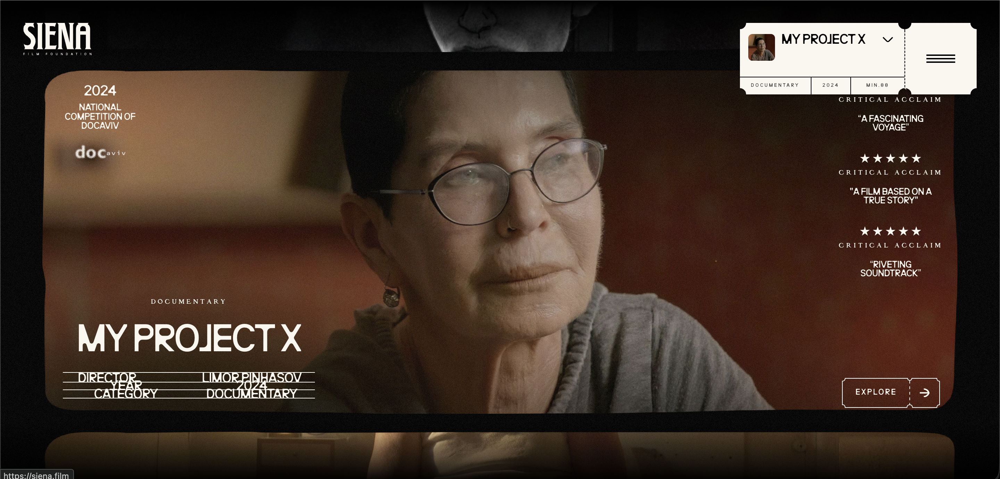
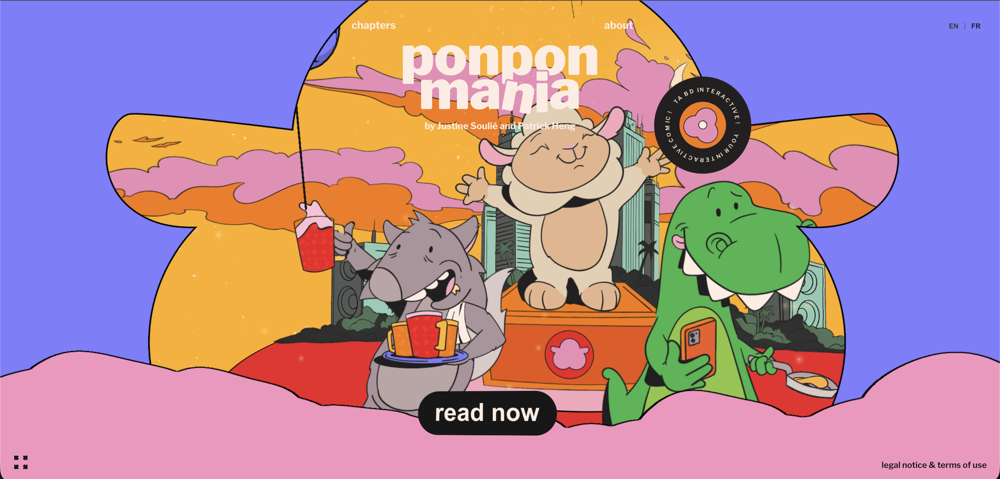
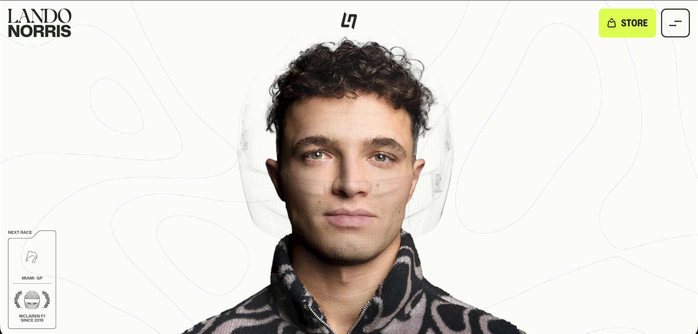
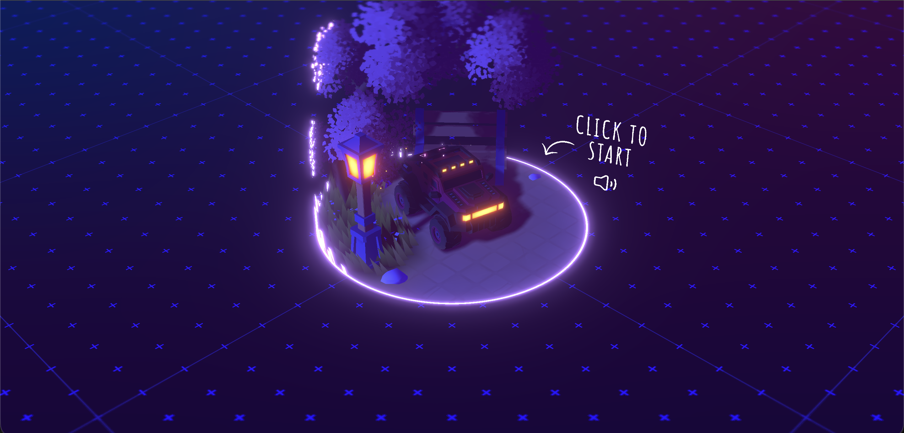
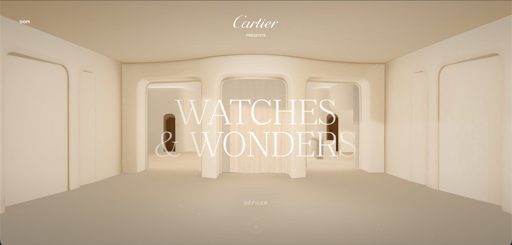
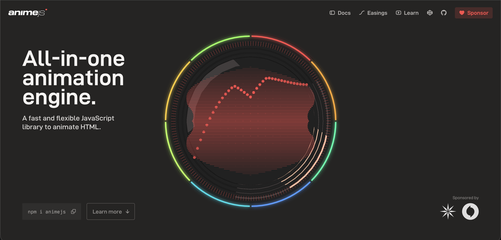

# Award-Winning Websites — 2025–2030 Reference

The websites that win Awwwards Site of the Year, FWA, and CSS Design Awards share a measurable formula. Signature visual identity built on modern CSS foundations. Purposeful scroll choreography executed with `GSAP` and `Lenis`. Performance budgets that hold 60fps on mid-range devices. Everything else is decoration.

Eight archetypes. One canonical winner per archetype. The technical foundations beneath them.

---

## 1 / The Eight Archetypes

Award-winning sites cluster into recognizable archetypes. Each demands different typography, color, layout, and animation strategies. Misidentifying the archetype is the first failure mode.

### 1.1 / Minimalist

Extreme whitespace. Two to three colors maximum. Every element justifies its existence.

Typography carries the design: `Inter`, `Suisse Int'l`, `Neue Haas Grotesk`, or `Söhne` at 48–120px headlines, light weights for elegance. Color holds in warm neutrals (`#FAFAF5`, `#E8E4DF`, `#2D2D2D`) or cool neutrals (`#F5F5F0`, `#0F172A`) with a single accent. Animation philosophy is restraint — fade-ins (opacity 0→1, translateY 20px→0, 0.6–0.8s), `Lenis` smooth scroll, `GSAP` Flip for transitions.

Use case: SaaS, luxury brands, architecture studios, high-end portfolios.

```css
/* Centered content with full-bleed escape hatch */
.wrapper {
  display: grid;
  grid-template-columns: 1fr min(65ch, 100%) 1fr;
  gap: clamp(3rem, 8vw, 12rem);
  padding: clamp(2rem, 5vw, 8rem);
}
.wrapper > * { grid-column: 2; }
.full-bleed { grid-column: 1 / -1; }
```

#### Reference — Terminal Industries

<a href="https://www.terminal-industries.com/" target="_blank" rel="noopener noreferrer">
  
</a>

**Site.** Terminal Industries
**URL.** `terminal-industries.com`
**Award.** Awwwards Site of the Month, September 2025 (+ Developer Award)
**Studio.** REJOUICE® and PROPAGANDE

Terminal Industries operates a B2B yard-management OS. The site is the textbook minimalist reference for 2025: two-color system, type-driven, generous whitespace, scroll-driven storytelling. One of the rare logistics-SaaS sites to crack SOTM tier — proof that restraint outperforms decoration in a category prone to overdesign.

---

### 1.2 / Brutalist / Neo-Brutalist

Deliberate rejection of polish. Thick black borders (2–4px). Hard-edged box shadows (4–8px offset, solid black). Flat colors. Zero gradients.

Typography is the design. `Monument Extended`, `Archivo Black`, `Space Mono` at 80–200px+. High-saturation accents against black and white — Gumroad's hot pink (`#FF90E8`), neon greens (`#00FF41`), clashing primaries. Animations include glitch effects, kinetic type that bounces and rotates, intentionally jarring transitions.

Use case: creative agencies, indie tech, streetwear, design conferences.

#### Reference — FlowFest 2025

<a href="https://www.flowfest.co.uk/" target="_blank" rel="noopener noreferrer">
  
</a>

**Site.** FlowFest 2025
**URL.** `flowfest.co.uk`
**Award.** Awwwards Site of the Day, July 29, 2025 (score 7.36) + GSAP Site of the Week
**Studio.** None — community build. Credited collaborators: Dennis Snellenberg, Isabel Edwards, Osmo, Ilja van Eck. Animation by Dennis and Ilja from Osmo.

No SOTM or SOTY winner in the 2024–2026 window cleanly hits the saturated Gumroad-style neo-brutalist profile; FlowFest 2025 is the closest credentialed match. It carries a flat `#F3A20F`/`#F97028` palette, chunky display type, and a raw illustrative aesthetic. At SOTM tier, `animejs.com` carries the brutalist palette in a more austere monochrome flavor, but serves the Bento archetype better.

---

### 1.3 / Editorial / Magazine

Defining characteristic: serif headlines paired with sans-serif body. `GT Sectra` or `Playfair Display` at 60–120px over `Inter` or `Neue Haas Grotesk` at 16–18px.

Multi-column grids — six to twelve columns — with asymmetric widths, pull quotes breaking flow, full-bleed hero images alternating with text-heavy sections. Image treatment uses high-contrast black-and-white, duotone, or desaturation with one accent color. Serifs returned hard in 2025–2026. Burberry's switch back to serif signaled the shift.

Use case: media, fashion, cultural institutions, luxury e-commerce.

```css
/* 12-column editorial grid */
.editorial-layout {
  display: grid;
  grid-template-columns: repeat(12, 1fr);
  gap: 1.5rem;
}
.feature-article { grid-column: 1 / 8; }
.sidebar { grid-column: 9 / 13; }
.pull-quote {
  grid-column: 3 / 11;
  font-style: italic;
  font-size: var(--fs-xl);
}
```

#### Reference — Siena Film Foundation

<a href="https://siena.film/" target="_blank" rel="noopener noreferrer">
  
</a>

**Site.** Siena Film Foundation
**URL.** `siena.film`
**Award.** Awwwards Site of the Month, March 2025
**Studio.** Undisclosed in the public Awwwards entry.

The strongest editorial reference in the 2024–2026 window. Awwwards' own case study describes its design as editorial typography in a minimalist filmic structure. Grotesque-serif voice, cinematic filmstrip slider, vintage-poster type, dual-menu editorial navigation, parallax photo-driven storytelling. Translates the magazine grammar of a print monograph into the browser more cleanly than any 2025 SOTY contender.

---

### 1.4 / Bold / Maximal

Every viewport inch filled with organized chaos. Layered compositions mixing photography, illustration, and 3D. Four to six colors at high saturation. Neon accents — electric lime (`#CCFF00`), hot magenta (`#FF00FF`).

Typography functions as art: 100–300px+ display sizes, variable fonts animated between weight and width, kinetic type splitting and reforming via `GSAP SplitText`. Animation is constant — parallax, scroll-triggered sequences, staggered reveals at 200–400ms offsets. Fonts: `Monument Extended`, `Clash Display`, `Satoshi`.

Use case: creative agencies, entertainment, music festivals, Gen Z brands.

#### Reference — Ponpon Mania

<a href="https://ponpon-mania.com/" target="_blank" rel="noopener noreferrer">
  
</a>

**Site.** Ponpon Mania
**URL.** `ponpon-mania.com`
**Award.** Awwwards Site of the Month, October 2025 (+ Developer Award; a SOTY 2025 contender, unverified)
**Studio.** Independent project.

An interactive comic about a megalomaniac sheep DJ. Built with `WebGL`, `GSAP`, `Matter.js` physics, and `Lenis`. Every hallmark of the archetype is dialed up: oversized animated panels, kinetic illustrated typography, overlapping comic compositions, saturated multi-color palette, music-player navigation metaphor. The reference for designers who think bold means timid.

---

### 1.5 / Immersive / Cinematic

Full-screen video heroes. WebGL 3D environments. Dark backgrounds — `#0A0A0A` to `#1A1A2E` — that make colors carry. Scroll-controlled video playback scrubs frames against scroll position.

`Three.js` dominates 3D. `GSAP ScrollTrigger` choreographs pinned sections with internal animation timelines. Spatialized audio via the Web Audio API completes the sensory layer. Glow effects via radial gradients, bloom, and lens-flare shaders create dramatic lighting.

Use case: automotive, luxury, entertainment, gaming, museums.

#### Reference — Lando Norris

<a href="https://landonorris.com/" target="_blank" rel="noopener noreferrer">
  
</a>

**Site.** Lando Norris
**URL.** `landonorris.com`
**Award.** Awwwards Site of the Day, November 17, 2025 (8.18); Site of the Year 2025 per the OFF+BRAND case study, unverified against the Awwwards annual page
**Studio.** OFF+BRAND

The strongest immersive build in this reference. Webflow as foundation. WebGL-powered 3D — rotating helmet, 3D scenes — combined with Rive motion graphics, GSAP scroll-driven cinematic sequences, full-bleed video, and lime-on-dark accents. Scroll-controlled narrative, 3D hero, cinematic transitions, automotive subject. Every immersive hallmark anchored in one site. Substitutable peer: `messenger.abeto.co` (Awwwards SOTD 10 Nov 2025 + Developer Award 8.21; the annual Developer Site of the Year title is unverified) — a Three.js miniature-planet experience, darker and moodier.

---

### 1.6 / Experimental / Art-Directed

No template. No repeatable pattern. Each site is bespoke. Mixed media combining photography, illustration, 3D, and generative art. Unconventional navigation — spatial exploration, physics-based interfaces, playground navigation. Creative coding with `p5.js`, custom GLSL shaders, noise functions, particle systems.

Use case: creative developer portfolios, art institutions, experimental campaigns.

#### Reference — Bruno Simon's Portfolio

<a href="https://bruno-simon.com/" target="_blank" rel="noopener noreferrer">
  
</a>

**Site.** Bruno's Portfolio
**URL.** `bruno-simon.com`
**Award.** Awwwards Site of the Month, January 2026 (+ Developer Award, Portfolio Honors December 2025)
**Studio.** None — solo creative developer (Bruno Simon).

Navigation is performed by driving a vehicle across a hand-coded `Three.js` landscape. Conventional grids, pages, and menus are abandoned in favor of spatialized audio, custom physics-based interactions, and unique per-area rooms. The ceiling of craft for the archetype. A solo creative developer outranking studios.

---

### 1.7 / Corporate Luxury

Quiet luxury. Sophisticated restraint. Generosity of whitespace signals exclusivity.

Custom serifs with sharp edges for headlines — `Didot`, `Bodoni`, `GT Sectra`. Refined sans-serifs for body — `Apercu`, `Founders Grotesk`. Color palettes rest on neutral foundations: warm whites (`#F8F5F0`), muted golds (`#C5A572`), jewel tones (deep emerald `#006D5B`, sapphire `#1B365D`), Pantone 2025's Mocha Mousse (`#A47764`).

Animations use long easing curves — `cubic-bezier(0.16, 1, 0.3, 1)` over 1–1.5s. Hover states limited to gentle opacity shifts and 1.05 scale.

Use case: high-end fashion, luxury hotels, fine jewelry, premium automotive, wealth management.

#### Reference — Cartier Watches & Wonders 2025

<a href="https://cartier-waw-0225.dev.60fps.fr/" target="_blank" rel="noopener noreferrer">
  
</a>

**Site.** Cartier Watches & Wonders 2025
**URL.** `cartier-waw-0225.dev.60fps.fr`
**Award.** Awwwards Site of the Day, August 18, 2025 — 7.64 (+ Developer Award)
**Studio.** Immersive Garden, with `60fps` and `Mooders`, for Cartier.

Built around Cartier's Geneva pavilion. Six contemplative 3D alcove universes around iconic timepieces. Slow tasteful motion. Refined typography. Hidden gestures. Bespoke cinematic soundscape. The platonic case for quiet-luxury restraint with sumptuous detail. Note the URL: live on the build studio's `dev.60fps.fr` subdomain rather than a Cartier-owned domain — unusual, but the canonical Awwwards-referenced location.

---

### 1.8 / Bento / Card-Based

Modular asymmetric tiles. Inspired by Japanese bento boxes, popularized by Apple keynotes. Consistent 12–20px border-radius. Equal gutter widths (12–24px). Large hero cards (2×2 spans) for primary features. Each tile is a self-contained information unit with its own visual treatment. Container queries enable self-aware tiles that adapt to their own dimensions.

The archetype is reaching saturation. Many designers report bento fatigue. Still highly functional for SaaS product pages.

Use case: SaaS, product launches, feature comparison pages.

```css
.bento-grid {
  display: grid;
  grid-template-columns: repeat(4, 1fr);
  gap: 1rem;
}
.bento-card {
  background: #12121a;
  border-radius: 16px;
  padding: 24px;
  border: 1px solid rgba(255,255,255,0.08);
}
.bento-card.large { grid-column: span 2; grid-row: span 2; }
.bento-card.wide  { grid-column: span 2; }
```

#### Reference — Anime.js v4

<a href="https://animejs.com/" target="_blank" rel="noopener noreferrer">
  
</a>

**Site.** Anime.js v4
**URL.** `animejs.com`
**Award.** Awwwards Site of the Month, May 2025 (+ Developer Award, Product Honors)
**Studio.** None — open-source library project led by Julian Garnier.

A canonical modern bento layout. A modular asymmetric grid of self-contained feature cards, each demoing one capability — scroll scrubber, lightweight modular core, complete animator's toolbox, layout-grid demos that morph between bento configurations. Consistent corner radii. Neutral palette. The Notion/Linear/Apple-iOS lineage executed at SOTM tier. The site is genuinely a hybrid — brutalist palette, bento structure — which is why some sources tag it brutalist. The structural logic is bento. Use it as the bento reference.

---

## 2 / Core UI Foundations

### 2.1 / Typography — variable fonts and fluid scales

Award winners use fluid typography with `clamp()`. Breakpoint-based sizing is obsolete.

```css
:root {
  --fs-sm:   clamp(0.8rem, 0.73rem + 0.36vw, 1rem);
  --fs-base: clamp(1rem, 0.91rem + 0.45vw, 1.25rem);
  --fs-lg:   clamp(1.56rem, 1.42rem + 0.73vw, 1.95rem);
  --fs-xl:   clamp(1.95rem, 1.77rem + 0.91vw, 2.44rem);
  --fs-xxl:  clamp(2.44rem, 2.21rem + 1.14vw, 3.05rem);
  --fs-hero: clamp(3.05rem, 2.76rem + 1.43vw, 3.81rem);
}
```

Variable fonts are the technical edge. A single file contains all weights, widths, styles. Real-time animation of `font-variation-settings` on hover and scroll becomes possible. Dominant variable fonts on Awwwards winners: `PP Neue Montreal`, `ABC Diatype`, `Inter`, `GT Flexa`, `Fragment`. For serif display: `GT Super`, `GT Sectra`, `Editorial New`. For extended display: `Monument Extended`, `Sharp Grotesk`, `Druk Wide`.

Five pairing strategies: contrast pairing (serif + sans with dramatic difference), outline mixed with solid weights, weight extremes (ultra-thin body with ultra-bold display), monospace accents for technical detail, editorial mixing of three or more typefaces in Swiss-inspired layouts.

For kinetic typography, `GSAP SplitText` is the standard. Free since Webflow's acquisition of GSAP. The v3.13+ syntax handles resize and font loading:

```javascript
SplitText.create(".headline", {
  type: "lines, words",
  mask: "lines",
  autoSplit: true,
  onSplit(self) {
    return gsap.from(self.words, {
      y: 100, autoAlpha: 0, stagger: 0.05,
      duration: 1, ease: "power3.out",
      scrollTrigger: { trigger: self.elements[0], start: "top 80%" }
    });
  }
});
```

### 2.2 / Color — OKLCH, dark mode, gradient strategy

OKLCH is the defining color advancement in modern CSS. Perceptually uniform manipulation. Eliminates the muddy middle that plagues sRGB gradient interpolation. All major browsers support it (`Chrome 111+`, `Firefox 113+`, `Safari 16.2+`).

```css
/* Vibrant gradient using OKLCH interpolation */
.gradient {
  background: linear-gradient(in oklch, oklch(70% 0.15 240), oklch(50% 0.15 340));
}

/* Derive colors from a single brand token */
:root { --brand: oklch(65% 0.2 250); }
.lighter { background: oklch(from var(--brand) calc(l + 0.15) c h); }
.muted   { background: oklch(from var(--brand) l calc(c - 0.08) h); }
```

Dark mode shifted from trend to baseline. 82% of mobile users prefer it. Award-winning implementations never use pure black or pure white. Backgrounds: rich dark grays (`#121212`, `#1E1E1E`) or deep navies (`#14213D`). Text: off-whites (`#E0E0E0`).

Five dominant color strategies on Awwwards winners: dark base + single saturated accent (most common), monochromatic depth via OKLCH lightness variations, earthy muted pastels for sustainability brands, neon micro-glow accents on dark surfaces, OKLCH-interpolated multi-hue gradients replacing flat sRGB gradients.

### 2.3 / Layout — broken grids, subgrid, full-bleed

CSS Grid enables faithful reproduction of editorial poster compositions. Asymmetric grids place elements with intentional overlap:

```css
.broken-grid {
  display: grid;
  grid-template-columns: 1fr 2fr 10fr 3fr 3fr 3fr 3fr 3fr 6fr 6fr 3fr;
}
.hero-image { grid-column: 3 / 9; grid-row: 2 / 7; }
.overlay-text { grid-column: 4 / 11; grid-row: 4 / 6; z-index: 2; }
```

CSS Subgrid is supported in all major browsers. Nested elements inherit parent grid tracks. Essential for card layouts where titles and content must align across cards. The Josh W. Comeau full-bleed pattern remains the standard for long-form content with breakout sections.

### 2.4 / Whitespace as weapon

Top studios treat whitespace as active design. Macro whitespace between sections uses 120–200px+ padding on desktop. Micro whitespace follows an 8px grid with fluid spacing tokens:

```css
:root {
  --space-s:  clamp(1rem, 0.75rem + 1.25vw, 1.5rem);
  --space-m:  clamp(1.5rem, 1rem + 2.5vw, 3rem);
  --space-l:  clamp(2rem, 1rem + 5vw, 6rem);
  --space-xl: clamp(4rem, 2rem + 8vw, 10rem);
}
section { padding-block: var(--space-xl); }
```

### 2.5 / Image and media treatment

`clip-path` animations are the signature image technique on award-winning sites. Hardware-accelerated. No layout shift.

```css
.image-reveal {
  clip-path: inset(0 100% 0 0);
  transition: clip-path 0.8s cubic-bezier(0.77, 0, 0.175, 1);
}
.image-reveal.visible { clip-path: inset(0 0 0 0); }
```

`mix-blend-mode: difference` on text overlaying images creates dynamic visual effects with one CSS property. Video backgrounds use muted autoplay with `object-fit: cover`. Under 10–15 seconds. Compressed below 5MB. `prefers-reduced-motion` swaps to static poster images.

---

## 3 / Interaction Design — Animation as Storytelling

### 3.1 / Page transitions enter the native era

The View Transitions API became Baseline Newly Available in October 2025. The most significant native page transition advancement to date. Cross-document MPA transitions require one CSS line:

```css
@view-transition { navigation: auto; }
```

Named element transitions create morph animations where a thumbnail transforms into a full-page hero:

```css
.product-thumbnail   { view-transition-name: product-hero; }
.product-full-image  { view-transition-name: product-hero; }

::view-transition-old(product-hero) { animation: fade-out 0.3s ease; }
::view-transition-new(product-hero) { animation: fade-in 0.3s ease; }
```

New 2025–2026 features: scoped view transitions (`element.startViewTransition()` on any HTMLElement), `view-transition-class` for grouping, React experimental integration via `<ViewTransition />`. For traditional multi-page sites, `Barba.js` (~7KB) paired with `GSAP` remains the dominant approach. AJAX page fetching with animated content swaps.

### 3.2 / Scroll-driven animations — GSAP is king, CSS API is rising

`GSAP ScrollTrigger` is the undisputed standard. All GSAP plugins became free in late 2024 after Webflow's acquisition.

```javascript
const tl = gsap.timeline({
  scrollTrigger: {
    trigger: '.section', start: 'top top', end: '+=1000',
    scrub: 1, pin: true
  }
});
tl.to('.title', { opacity: 1, y: 0 })
  .to('.image', { scale: 1.2 })
  .to('.text',  { opacity: 1 });
```

The CSS Scroll-Driven Animations API runs off the main thread for guaranteed 60fps. `Chrome 115+`, Interop 2026. `animation-timeline: scroll()` for scroll progress. `animation-timeline: view()` for viewport position:

```css
.card {
  animation: fade-in linear forwards;
  animation-timeline: view();
  animation-range: entry 0% entry 100%;
}
@keyframes fade-in {
  from { opacity: 0; transform: translateY(50px); }
  to   { opacity: 1; transform: translateY(0); }
}
```

`Lenis` (~2KB, by darkroom.engineering) replaced `Locomotive Scroll` as the standard smooth-scrolling library. Native `scrollTo` rather than transforms. Preserves `position: sticky`, Intersection Observer, other native APIs.

```javascript
const lenis = new Lenis({ autoRaf: true });
lenis.on('scroll', ScrollTrigger.update);
gsap.ticker.add((time) => lenis.raf(time * 1000));
gsap.ticker.lagSmoothing(0);
```

### 3.3 / Micro-interactions — the details judges notice

Custom cursors with lerp-based easing are nearly ubiquitous on creative agency sites. `requestAnimationFrame` with linear interpolation:

```javascript
const lerp = (a, b, n) => (1 - n) * a + n * b;
let mouseX = 0, mouseY = 0, cursorX = 0, cursorY = 0;
document.addEventListener('mousemove', (e) => {
  mouseX = e.clientX; mouseY = e.clientY;
});
function animate() {
  cursorX = lerp(cursorX, mouseX, 0.15);
  cursorY = lerp(cursorY, mouseY, 0.15);
  cursor.style.transform = `translate(${cursorX}px, ${cursorY}px)`;
  requestAnimationFrame(animate);
}
animate();
```

Magnetic buttons — elements that attract toward the cursor — are the defining micro-interaction. Distance from cursor to element center calculated, proportional displacement applied. Creative hover states include underline animations (`scaleX(0)` to `scaleX(1)` on `::after`), text scramble effects, image previews following the cursor on hover.

### 3.4 / WebGL — Three.js dominates, WebGPU arrives

`Three.js` remains the standard. 111K+ GitHub stars. ~5M weekly npm downloads. WebGPU support became production-ready in `Three.js r171+` (September 2025). One benchmark: WebGL at 15,000 objects at 15fps, WebGPU at 200,000 objects at 60fps with near-zero CPU usage.

For React: `React Three Fiber` adds declarative JSX over Three.js, paired with the `Drei` helper library. `OGL` (29KB total) handles lightweight shader effects when full Three.js is overkill. Common award-winning WebGL effects: image hover distortion via vertex displacement shaders, particle systems with custom GLSL, shader-based image-to-image transitions using noise functions, post-processing chains (bloom, color grading, vignette).

### 3.5 / Sound design — rare, differentiating

Sound remains rare. Award-winning sites that use it powerfully — Messenger, Bruno Simon's portfolio — treat it as a sensory layer, not a gimmick. Implementation requires user consent. Browser autoplay policies block unmuted audio.

The pattern: a splash page offering Enter With Sound / Enter Without Sound. Or a persistent mute toggle. `Howler.js` (23K+ stars) is the primary library. Micro-interaction sounds never exceed 0.3 seconds. Ambient sounds stay at 0.05–0.15 volume. Preferred format: WebM/Opus. MP3 as fallback.

---

## 4 / UX Patterns Judges Reward

### 4.1 / Navigation patterns

Full-screen overlay menus with animations dominate creative navigation. Award-winning implementations: 60–120px+ typography, staggered GSAP reveals (50–100ms per item), hover states that preview page content via mouse-following images, clip-path transition reveals. The hamburger menu works on desktop only when the overlay itself becomes an editorial experience.

Sticky headers with show/hide on scroll represent best practice for functional sites. Header disappears on scroll-down. Slides back on any scroll-up over ~300–400ms. Desktop headers stay under 10% of viewport height. Mobile headers stay under 60px. Glassmorphism bars with `backdrop-filter: blur()` are a popular treatment.

Mega menus suit sites with 20+ pages: multi-column layouts with descriptive text, embedded search, featured content zones, personalized quick-access links. Activate via hover with ~200ms delay. Click fallback for accessibility. On mobile, convert to accordion-style expanding sections.

### 4.2 / Scroll storytelling done right

Horizontal scroll sections work best when mapped to vertical scroll input — scroll down translates to content moving left. `GSAP ScrollTrigger` pins a container and translates inner content horizontally. The pattern suits visual-forward content where text reading is minimal.

Scroll hijacking succeeds only under specific conditions. Visual-only content. Short duration. An available skip mechanism. NN/Group usability research found that scroll hijacking on text-heavy content causes extreme frustration. Apple succeeds because it controls content behind and inside the animation. Most sites lack this precision. The safer approach: scroll-triggered animations where elements respond to scroll while the user retains full speed control.

### 4.3 / Portfolio and case study patterns

Top portfolios follow a consistent structure. Full-bleed hero image with project title and two or three key metrics. Brief problem framing. Process documentation with visual artifacts. Immersive walkthrough of the work. Bold large-type results — conversion percentage, revenue impact. Navigation to the next case study. Project grids use masonry layouts for varied imagery, organized 2–3 column grids with hover animations, or filtered grids using `GSAP Flip` for smooth state transitions.

### 4.4 / Luxury e-commerce differentiators

Award-winning e-commerce integrates brand narrative into the shopping flow. The buying experience is intentional, not transactional. Storytelling product pages (Apple model). Radical transparency with materials and pricing breakdowns (Everlane model). Real-time customization previews. Generous whitespace as exclusivity signal. Cart experiences use slide-in panels without page navigation.

Luxury e-commerce requires serif typography, generous spacing, delayed modals (never on load), and aspirational imagery where every visible product is shoppable.

### 4.5 / Mobile-first that still feels premium

Touch-first interactions following native app conventions. Swipe gestures. Bottom navigation bars. Thumb-zone optimization. Show-on-scroll-up is the gold standard for mobile headers. Typography uses `clamp()` for fluid scaling. Container queries enable modular responsive components.

Performance is non-negotiable. 53% of users abandon sites loading beyond three seconds. Dark mode support on OLED screens reads as both battery-efficient and premium. Gesture-based interactions always include button alternatives. Accessibility imperative.

---

## 5 / Technical Implementation Reference

### 5.1 / Advanced CSS

Container queries are Baseline in all browsers. Components respond to their container size rather than the viewport. The breakthrough for portable, reusable components.

```css
.card-container { container-type: inline-size; container-name: card; }
@container card (min-width: 400px) {
  .card { display: flex; gap: 1rem; }
}
```

CSS `:has()` enables complex conditional styling without JavaScript. Dynamic grid columns based on child count. CSS-only form validation styling. Previous-sibling selection. CSS-only dark mode toggles.

```css
.grid:has(:nth-child(4):last-child) { grid-template-columns: repeat(2, 1fr); }
.form-field:has(input:invalid) { border-left: 3px solid #e74c3c; }
:root:has(#dark-mode:checked) { color-scheme: dark; --bg: #111; }
```

`@property` gives CSS variables a type system. Smooth animation of gradients and values previously impossible to transition.

```css
@property --gradient-angle {
  syntax: "<angle>";
  inherits: false;
  initial-value: 0deg;
}
.gradient-bg {
  background: linear-gradient(var(--gradient-angle), var(--color-1), var(--color-2));
  animation: rotate-gradient 4s ease infinite;
}
@keyframes rotate-gradient { 50% { --gradient-angle: 180deg; } }
```

### 5.2 / JavaScript animation library comparison

| Library | Size | Best for | Key feature |
|---|---|---|---|
| `GSAP` | ~23KB core | Complex timelines, scroll | ScrollTrigger, SplitText (all free) |
| `Motion` (Framer Motion) | 34KB / 4.6KB lazy | React apps, UI transitions | Declarative API, layout animations |
| `Lenis` | ~2KB | Smooth scrolling foundation | Native scrollbar, preserves sticky |
| `Locomotive Scroll v5` | 9.4KB | Parallax + detection via data attrs | Built on Lenis, dual IntersectionObserver |
| `Theatre.js` | Core only in prod | Cinematic 3D scenes | Visual keyframe editor in browser |
| `Motion One` | 3.8KB | Lightweight vanilla JS | Built on WAAPI, off main thread |

`GSAP` is the industry standard for award-winning sites. `Motion` (Framer Motion) dominates React with a 2.5× speed advantage on unknown-value animations and a `LazyMotion` pattern that reduces bundle size to 4.6KB.

### 5.3 / WebGL framework selection

| Framework | When |
|---|---|
| `Three.js` | Maximum control, non-React projects (~150KB) |
| `React Three Fiber` | React apps needing rapid prototyping with `Drei` (~30KB over Three.js) |
| `OGL` | Bundle size critical (29KB total), custom shaders |
| `Curtains.js` | Lightweight image-on-plane distortion without full 3D scene management |

### 5.4 / Performance — visual richness without the cost

Four CSS properties composite on the GPU without triggering layout or paint: `transform`, `opacity`, `filter`, `backdrop-filter`. All animations target these exclusively.

```css
/* Triggers reflow */
.box:hover { width: 200px; left: 100px; }

/* GPU-composited */
.box:hover { transform: translateX(100px) scale(1.05); }
```

`content-visibility: auto` on below-fold sections skips rendering for off-screen content. Massive initial load gain. Intersection Observer handles lazy loading for both images and animation initialization. Dynamic imports load heavy libraries only when their containing section enters the viewport.

```javascript
const observer = new IntersectionObserver(([entry]) => {
  if (entry.isIntersecting) {
    import('gsap').then(({ gsap }) => { /* init animations */ });
    observer.disconnect();
  }
});
```

Image optimization uses the AVIF > WebP > JPEG cascade via `<picture>`. AVIF delivers ~50% smaller files than JPEG at equivalent quality. Font loading uses `font-display: swap` with `<link rel="preload">` for critical fonts. The Speculation Rules API enables near-instant page loads.

```html
<script type="speculationrules">
{
  "prerender": [{
    "where": { "selector_matches": ".prerender-link" },
    "eagerness": "moderate"
  }]
}
</script>
```

Award-winner targets: `LCP < 1.5s`, `CLS < 0.05`, `INP < 100ms`, total page weight under 3MB, sustained 60fps.

### 5.5 / Accessibility coexists with beauty

The surgical approach to `prefers-reduced-motion` replaces motion with opacity. It does not eliminate animation.

```css
@media (prefers-reduced-motion: no-preference) {
  .card { transition: transform 0.3s ease, opacity 0.5s ease; }
}
@media (prefers-reduced-motion: reduce) {
  .card {
    transition: opacity 0.2s ease;
    transform: none !important;
  }
}
```

For JavaScript-heavy animations — Three.js, scroll-linked — detect the preference, disable smooth scroll, reduce particle counts, simplify transitions. Custom cursors require `aria-hidden="true"`. Animated text split into characters needs `aria-label` on the parent with the full text. Skip links, `:focus-visible` styling, semantic HTML beneath creative layouts, ARIA live regions for dynamic content — all non-negotiable.

The European Accessibility Act took effect mid-2025. Legal requirement, not preference. accessiBe paid a $1M FTC fine. Overlay widgets are not accessibility.

---

## 6 / What Awwwards Judges Actually Evaluate

Awwwards weights four criteria: Design (40%), Usability (30%), Creativity (20%), Content (10%). Sites are sent to a minimum of 18 jury members. Three outlier scores eliminated. Honorable Mention requires `6.5+`. Site of the Day typically `7.5+`. Developer Award requires `7+` from the developer jury.

The gap between `6–7` and `8+` is measurable.

A `6–7` site is competent. Generic grid layouts. Stock photography. Desktop-first responsive breakpoints bolted on. No single interaction worth discussing. Template and AI-generated layouts are recognized instantly by jury members who are themselves working designers and developers.

An `8+` site has one signature unforgettable interaction. Cross-device parity where mobile is reconsidered, not merely responsive. Complex visuals that load fast on mid-range devices. Real content with genuine photography. Scroll as narrative — content unfolding with purpose and pacing. Precise animation choreography in timing, easing, and sequencing.

FWA (500+ jury members) rewards unconventional, experimental work more aggressively than Awwwards. Bold creativity and emerging technology usage matter most. CSS Design Awards scores UI (40%), UX (30%), Innovation (30%). WOTD requires average judge scores above 8.0. The most accessible for smaller teams and first submissions. Strategic path: submit to CSSDA first, use wins as credibility for Awwwards and FWA. Best submission months: February–April, September–November. Avoid late December–January.

---

## 7 / Studios That Win

`Locomotive` (Montreal) won Awwwards Agency of the Year in consecutive years — streak length unverified. Nine to twelve Sites of the Day annually since 2018. Created `Locomotive Scroll`, the open-source smooth scrolling library, now rebuilt on `Lenis` for v5. Stack: custom front-end with `Locomotive Scroll`, `Lenis`, `GSAP`. Competitive advantage: small team, craft culture, every project treated as award-worthy.

`Active Theory` (LA + Amsterdam). Premier WebGL/3D studio. Emmy nominations. Signature: immersive cinematic WebGL on pitch-black canvases with XXL `Monument Grotesk` headlines. Built `Hydra`, a proprietary 3D engine evolved since 2012. Built `Aura`, a platform running WebGL natively across eight platforms. Philosophy: WebGL wins when it deepens user involvement. Fog instead of textures. Light instead of detail. Achieves `LCP ~1.3s` despite heavy shader work — lazy-loaded videos via `requestIdleCallback`, Draco-compressed meshes.

`Resn` (Wellington + Amsterdam). 60 SOTD wins. 11 SOTM. Two SOTY. 350+ globally recognized awards. Signature: gooey interactive experiences with game design sensibilities. Pioneered 3D Gaussian Splatting for hyperreal web environments via Luma AI and PlayCanvas SuperSplat. Integrates AR face tracking and audio design as core elements.

`Immersive Garden` (Paris). Awwwards Agency of the Year 2025. Studio and Developer Site of the Year. Premium digital experiences for luxury — Louis Vuitton Collectibles, Longines Spirit Flyback, Cartier Watches & Wonders. Balances usability with emotional immersion.

Other consistently winning studios: `Cuberto` (sharp micro-interactions, custom cursor), `14islands` (Stockholm, AI-integrated design, Web Standards focus), `Dogstudio/Build in Amsterdam` (art-meets-technology WebGL), `Monogrid` (Italy, cinematic experiences for Prada, Netflix, Gucci), `Media.Monks` (58 SOTD, data + creativity fusion). Solo creative developers like `Aristide Benoist` win SOTD repeatedly through WebGL mastery and design collaboration.

The meta-pattern across the consistently winning studios: custom tooling (proprietary engines and libraries produce unique output), performance treated as design constraint from day one, design-development integration with no handoff model, intentional award strategy planned from project kickoff, client selection prioritizing brands that allow creative freedom with adequate budgets ($60K–$200K+).

---

## 8 / Trends Shaping 2025–2030

WebGPU replaces WebGL for high-performance 3D. `Three.js r171+` shipped production-ready WebGPU support with automatic WebGL fallback. Three Shading Language lets developers write shader logic in JavaScript and TypeScript, compiled to WGSL. `Safari 26` added support. Cross-browser availability complete.

The View Transitions API reaches production maturity. Cross-document transitions work with one CSS declaration. React Canary integrates `<ViewTransition />` for automatic orchestration. Scoped view transitions (`Chrome 140+`) enable multiple simultaneous transitions on one page.

CSS Scroll-Driven Animations API gains real-world adoption. Part of Interop 2026 with expanding browser support. Tokopedia replaced custom JS scroll implementations for better e-commerce performance. The new `animation-trigger` property (`Chrome 145`) enables scroll-triggered time-based animations, replacing most IntersectionObserver use cases.

AI transforms both the design process and the user experience. `Figma Make` and `UXPin Forge` generate production-quality layouts from actual React components. 73% of e-commerce sites use AI personalization with documented 15–35% conversion lifts. AI-driven interfaces adapt in real-time based on behavior, time of day, and inferred intent. AI-*generated* designs are immediately recognizable to experienced Awwwards judges and score poorly.

Spatial design principles migrate from visionOS to flat screens. Depth, layers, z-axis thinking inspired by Apple Vision Pro influence conventional web design. Elements at different z-depths with parallax, lighting effects, and glassmorphism create perceived dimensionality without requiring spatial hardware.

Apple's Liquid Glass accelerates glassmorphism maturation. Announced at WWDC 2025. The design language validates glassmorphism as a lasting design approach. Dark Glassmorphism — glass over dark backgrounds with ambient gradient color orbs — is one of 2026's defining UI treatments. Samsung One UI 7 and Windows 11 Fluent Design adopt similar material approaches.

Typography becomes the hero element. Oversized kinetic type functions as primary design rather than communication. Variable fonts enable weight and width animation on scroll and hover. Funky curvy serifs, novel italics, custom bespoke typefaces drive brand differentiation. Cross-cultural type systems — Lingua-Lettering — design unified visual rhythm across Latin, Arabic, and CJK characters.

Organic shapes replace geometric rigidity. Anti-grid layouts. Soft gradients. Flowing CSS clip-path curves. Nature-inspired distilled aesthetics with earthy tones. A reaction to the AI-saturated digital era. Grain, noise, and texture overlays create tactile authenticity — increasingly via animated procedural noise in Canvas or WebGL rather than static image overlays.

---

## 9 / Anti-Patterns

### 9.1 / Design

Template and AI-generated layouts. The single fastest way to fail. Jury members are working professionals who recognize them instantly.

Inconsistent design systems where the homepage is polished but inner pages weaker. A signal of incomplete craft.

Stock photography. A signal of generic thinking.

Desktop-first with responsive breakpoints bolted on. Fails the usability criterion (30% of score). Judges check mobile first.

### 9.2 / Performance

Greenspector's analysis of Awwwards mobile excellence nominees found sites routinely reaching 400+ HTTP requests and 12+ MB on full scroll. 1MB+ videos loaded without lazy loading. 20+ font file requests. Images loaded twice through poor implementation.

The fix: native lazy loading, facade pattern for third-party embeds, AVIF/WebP images, variable fonts (one file replacing 20+ requests), code splitting, Speculation Rules for prerendering.

### 9.3 / Trends past their expiry

Bento grid layouts have reached oversaturation.

Heavy parallax scrolling as primary effect is now performance drag, often perceived as superfluous.

Cookie-cutter minimalism — blanding — the safe muted geometric sans-serif default that every brand adopted. Actively rejected.

Generic chatbot widgets loading on page render. They obscure content. They add weight.

Static gradients as primary design element. No longer differentiated.

### 9.4 / Accessibility failures endemic to award-seeking sites

Award-winning sites are stunning, creative, inspiring, and rarely keyboard-navigable.

Common failures: no keyboard navigation for custom interactions, missing alt text on images and 3D elements, glassmorphism designs failing WCAG 4.5:1 contrast, `outline: none` applied globally for aesthetics, keyboard traps in modals, no `prefers-reduced-motion` respect for heavy animations.

The fix: build accessibility from day one as a design value. Not a retrofit.

### 9.5 / UX disguised as creativity

Scroll hijacking generates the most user frustration when applied to text-heavy content. NN/Group testing found it threatens user control, discoverability, attention, efficiency, and task success. Use scroll-triggered animations instead. Maintain user speed control.

Experimental navigation that requires discovery tanks usability scores even when creativity scores high.

The illusion of completeness. Scroll-based animations that pause, making users think they have reached the end. Causes content abandonment.

The style-over-substance trap. Beautiful animations that slow task completion. Custom cursors that obscure click targets. Impressive loading screens covering for 10+ second loads.

### 9.6 / The core tension and how winners resolve it

The 2025–2026 era is defined by tension between expressive immersive visual richness and the imperatives of performance, accessibility, and usability. Studios that consistently win resolve this through purposeful technology adoption — using WebGPU, GSAP, and CSS APIs because they serve user needs, not because they are flashy. Accessibility as design value from day one. Performance as a feature: variable fonts, native CSS animations, progressive loading. Story-driven design where every visual choice serves communication.

The formula is not maximum spectacle.

It is one unforgettable signature moment, executed with precision across every device, loading in under two seconds.
